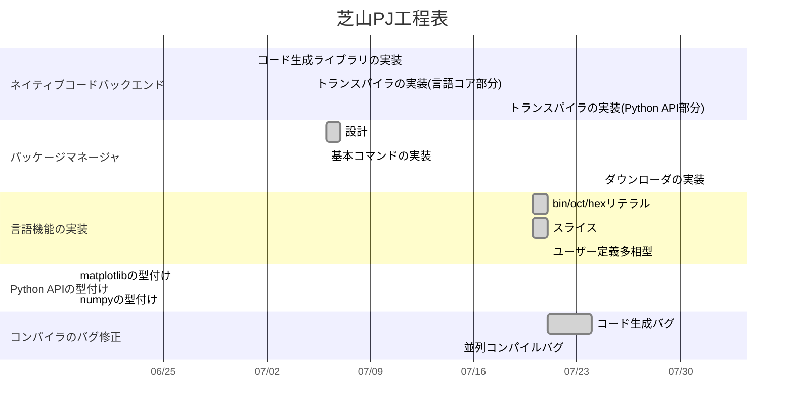

2023年度未踏 芝山PJ開発進捗報告(6~7月)
===
## 芝山駿介

<div style="page-break-after: always"></div>

# ネイティブバイナリバックエンド

## コード生成ライブラリ

ネイティブバイナリバックエンドは計画通りRustをトランスパイルして、生成した.rsファイルをコンパイルさせる方式で実装を始めた
RustのASTを構築してコードに戻せるcrate(ライブラリ)を選定したが、条件に適合するものがなかったので手ずから実装した

https://github.com/mtshiba/ruast

RustのASTなのでruastと命名した

<div style="page-break-after: always"></div>

## 採用を見送ったcrate

## `codegen`

https://github.com/carllerche/codegen

不採用理由: あまりメンテナンスされておらず、網羅性にも欠ける

<div style="page-break-after: always"></div>

## `rustc_ast`

https://github.com/rust-lang/rust/tree/master/compiler/rustc_ast

不採用理由: Rust本家のASTはprintableではなく、またRustプロジェクトが大きすぎてコンパイルに時間がかかる、またcrates.io(Rustライブラリのレジストリサイト)に登録されていない

<div style="page-break-after: always"></div>

## コード例

```rust
use ruast::*;

let mut krate = Crate::new();
let def = Fn::main(
    None,
    Block::from(Path::single("println").mac_call(vec![Token::lit("Hello, world!")])),
);
krate.add_item(def);
println!("{krate}");
krate.dump("test.rs")?;
krate.remove_item_by_id("main");
assert!(krate.is_empty());
```

上のコードではRust ASTを構築してdumpでファイルに書き出している

<div style="page-break-after: always"></div>

## トランスパイラ

ruastを用いたトランスパイラ(Galと命名)の方は、現在

* 関数呼び出し(print, assert)
* 変数・関数・メソッド定義
* コントロールフロー(if, for, while, match)
* 演算
* クラス定義
* import(Ergモジュールのみ)

を変換可能

<div style="page-break-after: always"></div>

## コンパイル(トランスパイル)実行例


<div style="page-break-after: always"></div>

Rustに変換するので当然ではあるが、fibonacci関数での簡易ベンチマークではPythonよりも10倍以上高速に実行された


これからはErgとの互換性を高めるためにバインディングライブラリやPython APIを模倣するRustライブラリを作っていく

<div style="page-break-after: always"></div>

# パッケージマネージャ

コードネームはpoiseとした(ただし`erg pack`から使えるのでユーザーが直接呼び出すことは基本ない)

計画通りErg自身で実装することとした
これはコンパイラのバグを炙り出すという副次的な目的があったが、良いのか悪いのか効果覿面で無数のバグが発見された

バグの修正が多すぎて実装が中断されてしまうという問題があり、よほど深刻なものでなければGitHub issueに上げてしばらくは棚上げする方針にした

現在は基本的なコマンドを実装してパッケージマネージャ自身をインストールできるようにした

<div style="page-break-after: always"></div>

現在できること:

* build: コードをコンパイルして成果物をbuildディレクトリに置く
* clean: buildディレクトリをclean-upする
* help: ヘルプを表示する
* init: パッケージを初期化する
* run: アプリケーションパッケージを実行する
* install: (シェルスクリプトを使った擬似)実行可能ファイルを作って`$ERG_PATH/bin`に置く


<div style="page-break-after: always"></div>

# 言語機能の実装

* スライスを実装

配列や文字列の一部を取り出す機能

* bin/oct/hexリテラルを実装

```python
0b10
0o123
0xdeadbeef
```

Pythonと同じ仕様で実装

<div style="page-break-after: always"></div>

# バグ修正

* ファイルサイズが大きくなるとコードがクラッシュするバグを修正
* 古いPythonのバージョンでコードが動かないバグを修正
* class memberで配列など多相型が使えない問題を修正
* several type system bugs
* 報告されたissue
	* [Eドライブ上でREPLが実行できない](https://github.com/erg-lang/erg/issues/443)
	* [random.choice!がエラーになる](https://github.com/erg-lang/erg/issues/442)
* 並列コンパイルに関するバグ(未解決)

<div style="page-break-after: always"></div> 

# 進捗チャート

灰色が完了、白が進行中、紫は未着手(2023/7/31現在)




