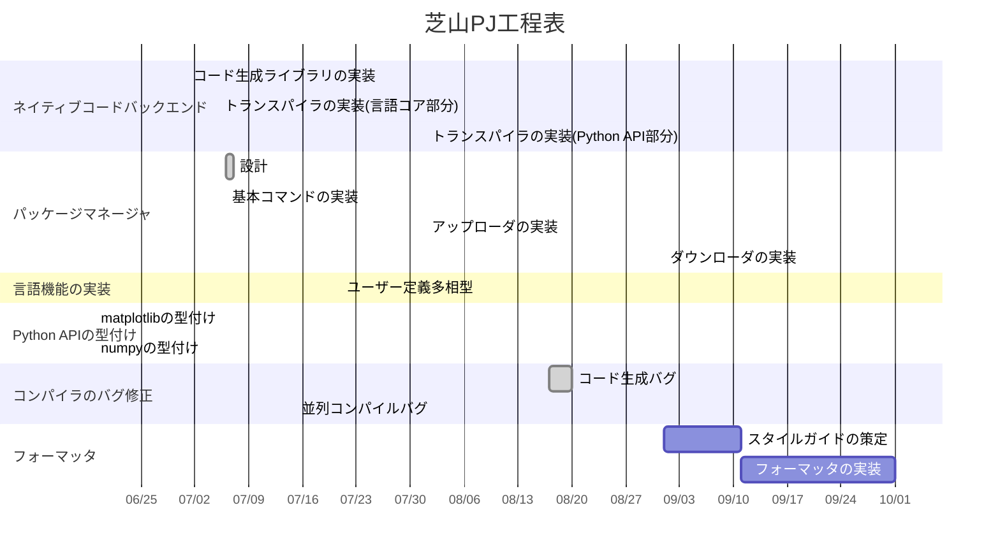

2023年度未踏 芝山PJ開発進捗報告(8月)
===
## 芝山駿介

<div style="page-break-after: always"></div>

# ネイティブバイナリバックエンド

## トランスパイラ

トランスパイラ内で使われる中間表現の設計を行なった。

---
# パッケージマネージャ

作成したパッケージを検証し、zipに圧縮してGitHub上で管理されるレジストリに登録できるpublish機能を追加した。
レジストリに登録されたアプリケーションのインストールもできるが、依存関係解決器が実装されていないため、依存関係を持たないもののみ可能。

現在使用可能なコマンド:
* publish: 作成したパッケージを検証し、GitHub上で管理されるレジストリに登録
* build: コードをコンパイルして成果物をbuildディレクトリに置く
* clean: buildディレクトリをclean-upする
* help: ヘルプを表示する
* init: パッケージを初期化する
* run: アプリケーションパッケージを実行する
* install: (シェルスクリプトを使った擬似)実行可能ファイルを作って`$ERG_PATH/bin`に置く
* metadata: パッケージのメタデータを表示

今後は依存関係解決器を実装し、ダウンローダや依存関係のupdate機能を追加していく。

---

# 言語機能の実装

* 依存型に関する機能強化

`numpy.ndarray`は多次元配列を表すクラスであり、学術計算で非常によく使われる。
このクラスには配列の次元情報を表す`shape`というメンバーが存在する。
この値が合わない配列同士の加算などは、実行時にエラーになるが、Ergの依存型を使えばコンパイル時にエラーを出すことが設計上可能だったため、外部モジュールに依存型を適用できるようにし、これを実現した。

![[numpy_shape.png]]

* Pythonバイトコード読み取りオプションの追加

Ergが生成したPythonバイトコードを逆解析して読み取る機能が今までなかったため、デバッグ目的で実装した。


* Hash traitの実装

Hashは辞書のキーやセットの要素に要求されるトレイトである。

```python
Hash = Trait {
	__hash__ = (self) -> Int
}
```

```python
_ = {"a"} # OK
_ = {"a": 1} # OK

_ = {1.0} # ERR, expected: Eq and Hash, but found: Float
_ = {1.0: "a"} # ERR
```

これまでは`Eq`しか要求されていなかったが、Python側で`__hash__`が必要であることに気づき`Hash`を追加した。

* assert casting機能の強化

assert casting機能とは、実行時検査を約束することで検査以後の式の型を狭めることができる機能である。

```python

i: Int # Intは整数、Natは自然数
# assert casting
assert i in Nat # assert i >= 0でも可
# i回処理を実行するtimes!は自然数であるNatにしか実装されていない
i.times! do!:
	print! ...

json = pyimport "json"
s = "{ \"key\": \"value\" }"
# この時点では辞書であるとは限らないので、インデックスアクセスはできない
jdata = json.loads(s) # jdata: Obj
# assert casting
assert jdata in {Str: Str}
assert jdata["key"] == "value"
```

これまでassert castingの効果があるのはローカル変数に限られてきたが、任意の式で行えるように拡張した。

```python
jdata = json.loads(s) # jdata: Obj
assert jdata["key"] in Str # inの左辺に任意の式を置ける
assert jdata["key"].upper() == "VALUE" # upperはStr型のメソッド
```

* ユーザー定義再帰型のサポート

定義に自身を含むようなクラス・トレイトが定義可能になった。
これはブースト会議で未踏OBである伊藤謙太朗氏より指摘された言語機能である。

```python
IntList = Class NoneType or { .node = Int; .next = IntList }

IntList.
	null = IntList::__new__ None
	insert self, node = IntList::__new__ { .node; .next = self }
	fst self = match self::base:
		{ node; next = _ } => node
		None => None

l = IntList.null.insert 1
assert l.fst() == 1
```

しかし以下のような一般的なリスト型は、まだ定義可能でない。
ユーザー定義多相型の実装とともに可能になるはずである。

```python
List T = Class NoneType or { .node = T; .next = List T }
```

* Trait associated types

Rustの同名機能に相当する言語機能である。トレイトの中でAPIのシグネチャに使われる型を定義できる機能である。これまで言語内部でのみ使用できていた機能を、ユーザーから利用可能なようにした。

```python
IO = Trait {
	.Inp = Type
	.Out = Type
	.func = (self, x: .Inp) -> .Out
}

C = Class()
C|<: IO|.
	Inp = Int
	Out = Bool
	func self, i = i >= 0

# io: |I <: IO|(x: I, I.Inp) -> I.Out
io x, y = x.func y
assert io C.new(), 1
```

* パターンマッチング機能の強化

配列に対してパターンマッチできるようになった。

```python
l = [1 + 1, 2 + 2]
ans = match l:
	[1, 2] -> "NO"
	[2, 4] -> "YES"
    _ -> "???"
assert ans == "YES"
```

* NamedTupleの追加

Pythonの標準ライブラリでよく出現するNamedTuple(ErgのRecordとTupleを合わせたようなデータ構造)を実装した。

```python

# uname!: () => NamedTuple {.system = Str; .node = Str; .release = Str; .version = Str; .machine = Str}
{uname!;} = pyimport "platform"

un = uname!()
assert un.system == "Darwin"
assert un[0] == "Darwin"
```

--- 

# Language Server

* テスト基盤の実装

これまでLanguage serverの機能は改修のたびに直接操作して正常に動作しているか確認していたが、非効率であるので、エディタを模倣しサーバーと通信するモックを作り、これを用いて自動テストを実装した。

* キャッシュ機構の改善

不要な再計算を行わなくなったことにより、サーバーがハングするケースが減少していることが確認された。

* 再起動機能の実装
* エラー誤報告バグの修正

# バグ修正

* コード生成に関するバグ

以前より確認されていた、古いPythonのバージョンでバグが発生する事象を修正し、CIに載せることができるようになった。

* Record型、Refinement型の部分型付け規則に関するバグ
* 型変数の代入機構に関するバグ
など

# その他

* 8/10に[Erg 0.6.18](https://github.com/erg-lang/erg/releases/tag/v0.6.18)を、8/24に[Erg 0.6.19](https://github.com/erg-lang/erg/releases/tag/v0.6.19)をリリースした。次回リリース(Erg 0.6.20)予定は9/7である。
# 問題

7月末に発見された並列コンパイルに関するバグは未解決であり、引き続き修正にあたる。これはモジュールのコンパイル順序の不定性に起因するバグであるので、解析前にモジュールのコンパイル順序を決定するplannerを実装することで解決する。

# 今後の予定

パッケージマネージャでは、依存関係解決器を実装し、ライブラリの依存関係を管理できるようにする。その他、公開に向けて必要な機能を実装する。

ネイティブコードバックエンドでは、より多くのコードを変換できるよう機能強化を進めるほか、バインディング機構の実装を行う。

言語機能では、ユーザー定義多相型の実装を進め、その他パッケージマネージャ/Language Serverの実装で必要になった機能やコンパイラのバグ修正等を行う。

また、フォーマッタの実装も開始する。それに先立ち、Erg言語のコーディングスタイルガイドを策定する。

# 進捗チャート

灰色が完了、白が進行中、紫は未着手(2023/9/1現在)




